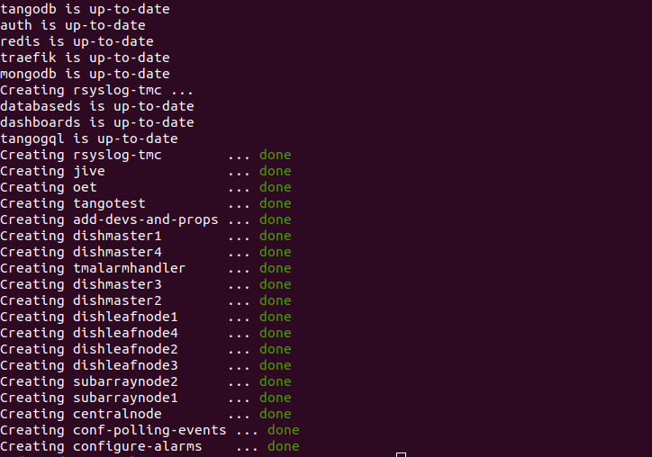
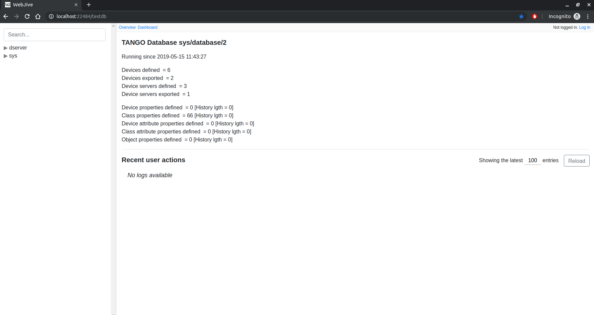
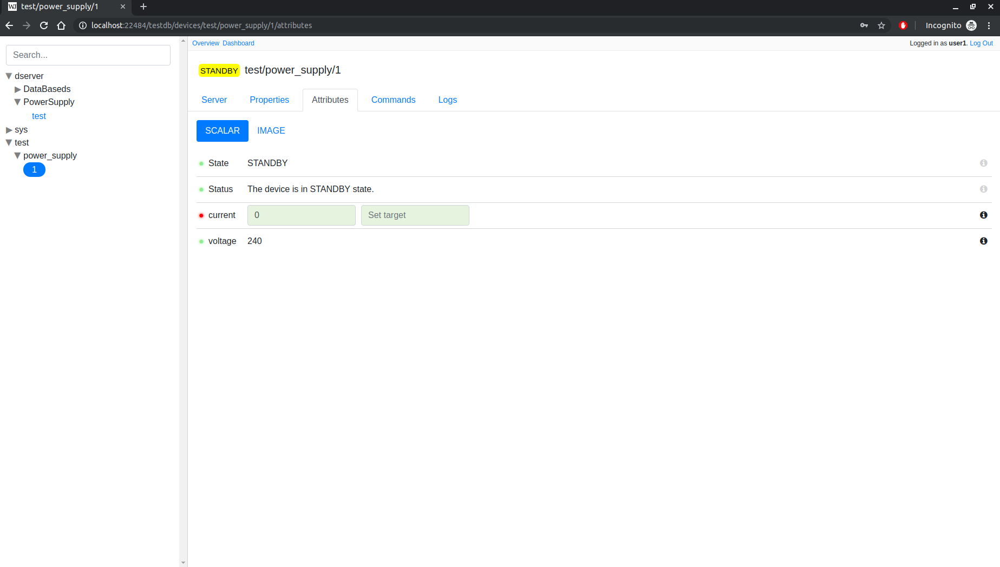
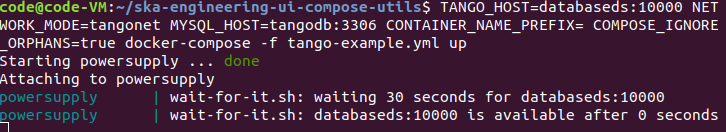
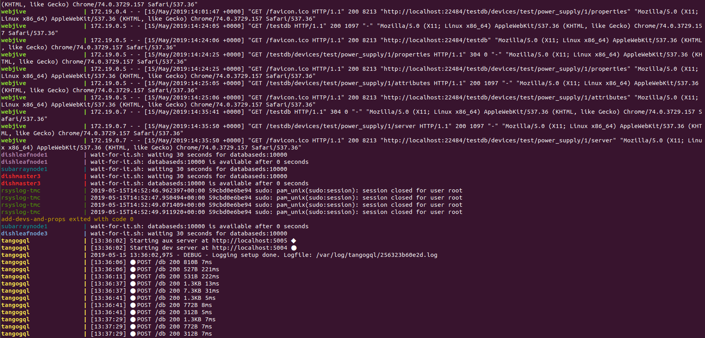

Basic steps to link Webjive to a real tango device
===================================================

This relates to how a developer can connect a new tango device to webjive.

First step setup the local developer environment
------------------------------------------------

In order to have WebJive and a minimal Tango system working on your local environment you should follow the guidelines on :doc:`./usage`.
After the `make up` command you should see something like this on the command line:

|image0|

To verify that everything is running well after those steps just go to |Webjive| and you should see something like this:

|image1|

Create a new device to add on webjive
-------------------------------------

To create a new device on your local environment, just follow the documentation on |tango-example|.
Alternately to test you can just use the already built docker image on `nexus.engageska-portugal.pt/tango-example/powersupply:latest` 

Setup tango device connection to webjive
----------------------------------------

The connection between webjive and a tango device or server is done by the var `TANGO_HOST` for more info about this go to |tango-controls|

To see how to setup the connection between tango-example and webjive just follow |tango-example.yml|

This `tango-example.yml` file is already in this project, to start up tango-example just do 

.. code-block:: console

   make start tango-example

By the end of the command if you go to `http://localhost:22484/testdb <http://localhost:22484/testdb>`__ you should see the following:

|image2|

Debug the created tango device
------------------------------

In order to be able to debug the device you just created you can for example run the following code [1]_:

.. code-block:: console

    TANGO_HOST=databaseds:10000 NETWORK_MODE=tangonet MYSQL_HOST=tangodb:3306 CONTAINER_NAME_PREFIX= COMPOSE_IGNORE_ORPHANS=true docker-compose -f tango-example.yml up

Then you should see this on the command line:

|image3|

This is the output of tango-example device (powersupply), this will vary from different devices

In order to debug all the devices and webjive-suite itself you can just run [2]_:

.. code-block:: console

    make debug

You should see something like this on the command line:

|image4|

This will update with the runtime debug, you can just refresh the webjive page to see the output

Notes
-----

.. [1]
   The vars my change on different machines, running `make up` you get your vars on the command line

.. [2]
   This will also start jive

.. |Webjive| raw:: html

   <a href="http://localhost:22484/testdb" target="_blank">Webjive</a>
.. |tango-example| raw:: html

   <a href="https://developer.skatelescope.org/projects/tango-example/en/latest/" target="_blank">tango-example</a>

.. |tango-controls| raw:: html

   <a href="https://tango-controls.readthedocs.io/en/latest/administration/deployment/starting.html" target="_blank">tango-controls</a>

.. |tango-example.yml| raw:: html

   <a href="https://github.com/ska-telescope/ska-engineering-ui-compose-utils/blob/master/tango-example.yml" target="_blank">tango-example.yml</a>

