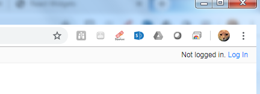
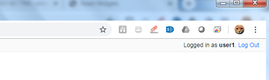

Steps to get Webjive running locally
************************************

The guide below assumes that the user has no previous versions of Webjive installed.  At the time of writing there are a number of ways in which Webjive can be launched.  However from a user point of view the way that should be adopted is given below because it will ensure that the ‘latest’ stable version is used. This guide assumes no previous versions of Webjive are present. \ [#F1]_\ 

Prerequisites
-------------

It is assumed that the following are installed and working correctly before attempting to launch Webjive:

* Python 2.7.x

* Make

* Sphinx

* Git

* Docker 3.0

Steps
~~~~~

#. Obtain the latest ska-engineering-ui-compose-utils project from the. https://github.com/ska-telescope/ska-engineering-ui-compose-utils  repository. The local ReadMe of this repository describes how to get Webjive up and running. Steps 2-4 below summarise the process.

#. Launch Webjive and TangoGQL. Using the terminal / command prompt, navigate to the local copy of ska-engineering-ui-compose-utils. Use the following make command to begin the setup process: 

            make up

This step may take some time to complete because all of the supporting material for Webjive will be acquired from various repositories before being installed.

#. Go to your local web-browser and enter the following into the address / URL bar:  

            localhost:22484/testdb/dashboard

The web browser should present a screen similar to that shown in figure 2.

#. At the top right-hand corner of the webpage (not the browser) click on the login button and enter the following credentials\ [#F2]_\ . 

.\ |IMG3|\ 

**Figure 4. Screenshot to show what the user should see when Webjive is running but no user logged in.**

Currently SKA Webjive uses the generic username and password credentials:

		Username: user1

		Password: abc123

.\ |IMG4|\ 

**Figure 5. Screenshot to show what the user should see when correctly logged in with the user1 credentials.**

It should be noted that functionality is greatly reduced unless the user is logged in and it is not possible to save newly created or edited dashboards.