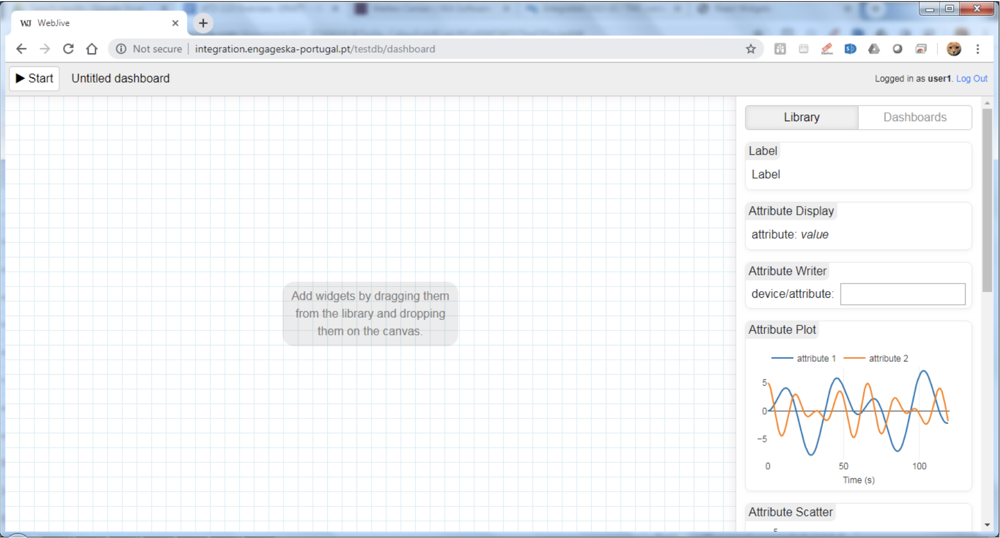
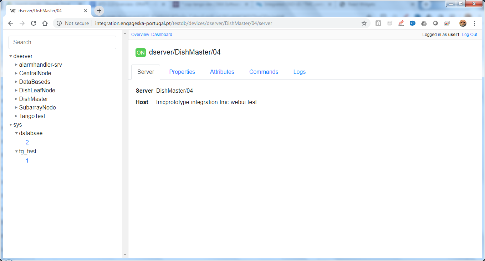

Overview
********

Webjive is a web-based program that allows a user to create a visual interface using widgets, which may include charts, numerical indicators or dials that interface to Tango device back end database.  Details of how this is programmatically achieved is presented in a developer biased document which can be found at: https://developer.skatelescope.org/projects/ska-engineering-ui-compose-utils/en/latest/device.html

Webjive was conceived and originally created by the MAX IV synchrotron facility in Lund, Sweden. During the early User Interface identification and downselect process conducted by the SKA OSO-UI Buttons team, Webjive was highlighted as a possible candidate to be taken forward as the platform upon which the SKA Engineering User Interface could be built.  In early 2019 discussions between MAX IV and OSO-UI Buttons team (overseen by SKA) were held and it was agreed that a collaborate relationship could be taken forward to develop and maintain Webjive.

Logging into Webjive presents the user with a screen showing the available Tango devices that can be interfaced with and some general statistics regarding the connected Tango database.  An example of this is shown in Figure 1

.\ |IMG1|\ 

.. |IMG1| image:: _static/img/overview_1.png
   :height: 322 px
   :width: 601 px

**Figure 1. Screenshot to show the Webjive screen when user goes to ‘localhost:22484/testdb’ in web browser.**

Webjive Widgets
===============

The right hand side of the web interface, as highlighted in figure 2, presents the Webjive widgets which can be utilised in the creation of the Engineering User Interface by the user . 

.\ |IMGGRAPH|\ 

**Figure 2. Screenshot to show Webjive screen when user goes to ‘localhost:22484 /testdb/dashboard’ in web browser. The available widgets are located on the right of the screen.**

Webjive widgets, like react widgets, are components which allow the user to obtain, view and handle their data in a straightforward and repeatable manner. Webjive currently has the following widgets:

* Label

* Attribute Display

* Attribute Writer

* Attribute Plot

* Attribute Scatter

* Spectrum

* Command Executor

* Attribute Dial

TangoGQL
========

The left hand side of the web interface houses the accessible Tango database devices.  It should be possible to use the Tango Controls program Jive to access the same Tango devices database as what is presented in this column.

.\ |IMG2|\ 

**Figure 3. Screenshot to show the devices screen of Webjive. Tango devices that may be connected to are presented on the left of the screen.**

Linking to TangoGQL
-------------------

This activity should be viewed as a developer level activity.  As such a procedure to add Tango devices to the linked database is provided in the SKA Developer portal at: https://developer.skatelescope.org/projects/ska-engineering-ui-compose-utils/en/latest/device.html 