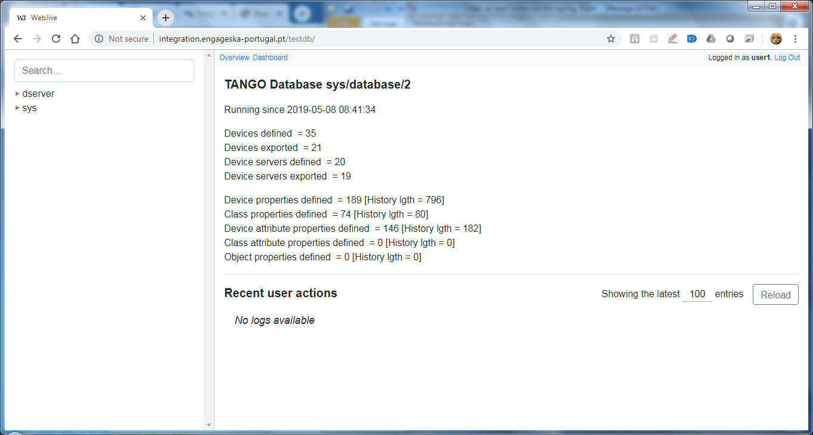
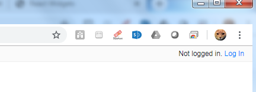
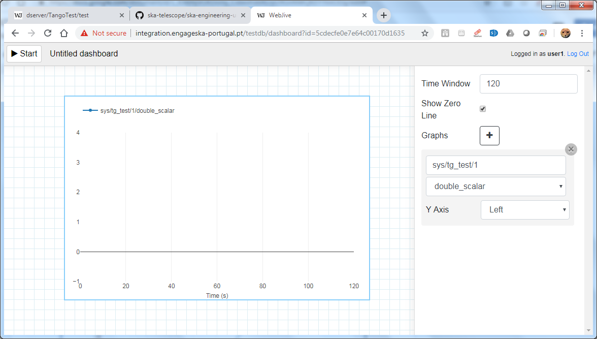

Webjive User Information
************************

The purpose of this guide is to provide new users of Webjive with information on the following:

* Overview of Webjive

* How to run Webjive locally

* How to use Webjive and connect with the Tango devices

Overview
========

Webjive is a web-based program that allows a user to create a visual interface using widgets, which may include charts, numerical indicators or dials that interface to Tango device back end database.  Details of how this is programmatically achieved is presented in a developer biased document which can be found at: https://developer.skatelescope.org/projects/ska-engineering-ui-compose-utils/en/latest/device.html

Webjive was conceived and originally created by the MAX IV synchrotron facility in Lund, Sweden. During the early User Interface identification and downselect process conducted by the SKA OSO-UI Buttons team, Webjive was highlighted as a possible candidate to be taken forward as the platform upon which the SKA Engineering User Interface could be built.  In early 2019 discussions between MAX IV and OSO-UI Buttons team (overseen by SKA) were held and it was agreed that a collaborate relationship could be taken forward to develop and maintain Webjive.

Logging into Webjive presents the user with a screen showing the available Tango devices that can be interfaced with and some general statistics regarding the connected Tango database.  An example of this is shown in Figure 1

.\ |IMG1|\ 

**Figure 1. Screenshot to show the Webjive screen when user goes to ‘localhost:22484/testdb’ in web browser.**

Webjive Widgets
===============

The right hand side of the web interface, as highlighted in figure 2, presents the Webjive widgets which can be utilised in the creation of the Engineering User Interface by the user . 

.\ |IMGGRAPH|\ 

**Figure 2. Screenshot to show Webjive screen when user goes to ‘localhost:22484 /testdb/dashboard’ in web browser. The available widgets are located on the right of the screen.**

Webjive widgets, like react widgets, are components which allow the user to obtain, view and handle their data in a straightforward and repeatable manner. Webjive currently has the following widgets:

* Label

* Attribute Display

* Attribute Writer

* Attribute Plot

* Attribute Scatter

* Spectrum

* Command Executor

* Attribute Dial

TangoGQL
========

The left hand side of the web interface houses the accessible Tango database devices.  It should be possible to use the Tango Controls program Jive to access the same Tango devices database as what is presented in this column.

.\ |IMG2|\ 

.. |IMG2| image:: _static/img/overview_2.png
   :height: 324 px
   :width: 601 px

**Figure 3. Screenshot to show the devices screen of Webjive. Tango devices that may be connected to are presented on the left of the screen.**

Linking to TangoGQL
-------------------

This activity should be viewed as a developer level activity.  As such a procedure to add Tango devices to the linked database is provided in the SKA Developer portal at: https://developer.skatelescope.org/projects/ska-engineering-ui-compose-utils/en/latest/device.html 

Steps to get Webjive running locally\ [#F1]_\ 
==============================================

The guide below assumes that the user has no previous versions of Webjive installed.  At the time of writing there are a number of ways in which Webjive can be launched.  However from a user point of view the way that should be adopted is given below because it will ensure that the ‘latest’ stable version is used. This guide assumes no previous versions of Webjive are present.

Prerequisites
-------------

It is assumed that the following are installed and working correctly before attempting to launch Webjive:

* Python 2.7.x

* Make

* Sphinx

* Git

* Docker 3.0

Steps
~~~~~

#. Obtain the latest ska-engineering-ui-compose-utils project from the. https://github.com/ska-telescope/ska-engineering-ui-compose-utils  repository. The local ReadMe of this repository describes how to get Webjive up and running. Steps 2-4 below summarise the process.

#. Launch Webjive and TangoGQL. Using the terminal / command prompt, navigate to the local copy of ska-engineering-ui-compose-utils. Use the following make command to begin the setup process: 

            make up

This step may take some time to complete because all of the supporting material for Webjive will be acquired from various repositories before being installed.

#. Go to your local web-browser and enter the following into the address / URL bar:  

            localhost:22484/testdb/dashboard

The web browser should present a screen similar to that shown in figure 2.

#. At the top right-hand corner of the webpage (not the browser) click on the login button and enter the following credentials\ [#F2]_\ . 

.\ |IMG3|\ 

**Figure 4. Screenshot to show what the user should see when Webjive is running but no user logged in.**

Currently SKA Webjive uses the generic username and password credentials:

		Username: user1

		Password: abc123

.\ |IMG4|\ 

.. |IMG4| image:: _static/img/overview_4.png
   :height: 130 px
   :width: 438 px

**Figure 5. Screenshot to show what the user should see when correctly logged in with the user1 credentials.**

It should be noted that functionality is greatly reduced unless the user is logged in and it is not possible to save newly created or edited dashboards.

How to quick start guide
========================

This section aims to provide a high level guide to using Webjive in terms of starting and stopping a session. It also provides an example of how a user can drag and drop a widget onto the canvas, followed by connecting it to a tango device present in the tango device database.  This example is not an extensive how to guide to guide the user through all widget and device connection options, be rather an example which gives an idea about the approach that should be adopted when using Webjive.

Starting the Webjive session
----------------------------

Once the user has placed widgets on the user interface screen and connected them to the appropriate tango device, as described above, the session of Webjive can be started, i.e. data exchange between the device(s) and Webjive can commence.  To do this the ‘Start’ button on the top left of the screen should be pressed.  If started successfully, the ‘Start’ button name should change to ‘Stop’, and after a short delay pertinent data should be presented in the widget(s).

Stopping the Webjive session
----------------------------

To end a running session of Webjive, the user should press the button labelled ‘Edit’ in the top left of the screen, which is the exact same place where the ‘Start’ button was located.

Connecting Tango devices to Webjive widgets
-------------------------------------------

Click on the Webjive dashboard button from the localhost//:22484/testdb/ page to get to the canvas and widget menu, as shown in figure 2.

Drag and drop the required widget on to the canvas. In this example the ‘attribute plot’ is dragged into the canvas, as shown in Figure 6.

.\ |IMG5|\ 

.. |IMG5| image:: _static/img/overview_5.png
   :height: 341 px
   :width: 601 px

**Figure 6. Screenshot showing the ‘attribute plot’ widget just dragged onto the canvas.**

Once the widget is on the canvas the widget menu is replaced with a configuration table for the attribute plot, as can be seen in Figure 6. In this instance the user has the option to change the time frame of the data that is shown on the plot before the data begins to scroll.  Click on the + labelled ‘Graphs’. Begin to type in the path to the device which is to be connected to be presented with a reducing list of options of available devices (Figure 7). 

.\ |IMG6|\ 

.. |IMG6| image:: _static/img/overview_6.png
   :height: 341 px
   :width: 601 px

**Figure 7. Screenshot showing the ‘attribute plot’ tango device options once the + button pressed.**

Click on that which you which to be displayed in the attribute plot.  In this example we will select ‘sys/tg_test/1’ and opt to retain the Y-axis on the left hand side of the display (Figure 8).

.\ |IMG7|\ 

.. |IMG7| image:: _static/img/overview_7.png
   :height: 341 px
   :width: 601 px

**Figure 8. Screenshot showing sys/tg_test/1 being selected from Tango device options.**

Now the user has to select an attribute(s) to be presented on the attribute plot.  In this example we will opt to present just one attribute on the plot, which will be ‘double scalar’ as can be seen in Figure 9. To add further plots to this ‘attribute plot’, click on the + and repeat the process of selecting the device and attribute followed for ‘double scalar’.

.\ |IMG8|\ 

**Figure 9. Screenshot showing the double_scalar attribute of ‘sys/tg_test’ being linked to ‘attribute plot’.**

Click on the ‘Start’ button. The buttons label changes to ‘Edit’, and the connection between the Tango device and the Webjive widget is established.  Data will begin to flow between the device and the widget and be presented on the plot.

.\ |IMG9|\ 

.. |IMG9| image:: _static/img/overview_9.png
   :height: 341 px
   :width: 601 px

**Figure 10. Screenshot showing the population of ‘attribute plot’ when the Webjive session is running.**

Note that once the Webjive session starts (Figure 10), the user will be unable to edit the widget parameters or canvas layout until the session is stopped using the ‘Edit’ button.

To conclude the Webjive session, the user must press the ‘Edit’ button.  This may seem counterintuitive, but in essence the ‘Edit’ button is the Stop button. Pressing this button does **not** imply that the user must edit the canvas.

For the purposes of this example the Tango device ‘sys/tg_test/1’ belonging to the Webjive Demo Tango Database was used. This is a good test device to use when setting up Webjive initially to establish correct operation.  However when using your own Tango device or linked database, the user should establish the validity of the data being presented on the Webjive widget by some other means to ensure data integrity. One possible means of achieving this is to have an instance of Tango Jive running in parallel to ensure that the data being seen on webjive is the same as that seen on Jive.

Webjive Session Persistence
===========================

A key feature of Webjive is the ability to save a session layout which a User has created, so that it can be reused or edited in the future.  It is important to note that exchanged data is not retained in this file, but rather the session configuration and layout.

Saving the Webjive session 
---------------------------

Once a Webjive session layout has been created and appropriate links between widgets and Tango devices, it can be saved by giving the dashboard a new. A fresh dashboard automatically is named ‘Untitled dashboard’.  The user can simply click and delete this name and replace it with an appropriate dashboard name of choice.

Loading the Webjive session
---------------------------

To open a saved Webjive layout locate and click on the ‘Dashboards’ button (next to the Library button) at the top of the widget drag and drop menu. This will present the user with all available Dashboards. Locate the Dashboard the user wishes to open and click on it. After a short pause the dashboard will have loaded and its widgets displayed on the canvas.

It should be noted that editing the canvas of a dashboard will automatically modify that dashboard and will be saved as such.

Online Demo
===========

It is possible to tryout Webjive before installing a local version.  However this is limited in that the user cannot save or edit canvas or add new Tango devices to the database.  The following link leads to the latest version of the demo available on the SKA repository. http://integration.engageska-portugal.pt/testdb

.. rubric:: Footnotes

.. [#f1]  Guidance created using Readme of the ska-engineering-ui-compose-utils and notes from ticket AT2-139. Link is  `https://github.com/ska-telescope/ska-engineering-ui-compose-utils <https://github.com/ska-telescope/ska-engineering-ui-compose-utils>`__ 
.. [#f2]  Currently SKA Webjive uses the generic username and password credentials

