Demonstrating Webjive Suite Publish / Subscribe
************************************************

When subscription to an attribute is made, the Webjive suite establishes the type of polling mechanism that attribute uses.  With this knowledge the Webjive suite determines and selects the most appropriate way to interact with Tango. If Tango events are set up for that attribute, they will be used. However if they aren't the Webjive suite reverts back to using the original mechanism of TangoGQL polling the attribute then publishing updates to the webjive user interface when it changes.

This page shows how to set up the Webjive suite publish / subscribe (pub/sub) mechanism using the ‘tangotest’ and ‘webjivetestdevice’ tango device servers. When setting up pub/sub for your own tango devices, you should substitute the aforementioned tango devices with your own.

To follow this guide you will need to have an instance of Webjive suite and Tango Jive running locally. The easiest way of doing this is to use the images available through the Gitlab repository ska-engineering-ui-compose-utils.

Getting Started
===============
Webjive Suite set up
--------------------
Using a terminal, go to the ska-engneering-ui-compose-utils. Using the following make commands start the mvp, tango test and webjive test device images. Webjive suite will be launched as part of this.

* make mvp
* make start tangotest
* make  start webjivetestdevice

Go to a web-browser of choice and open the Webjive suite:

http://localhost:22484/testdb/devices

.\ |IMG1|\ 

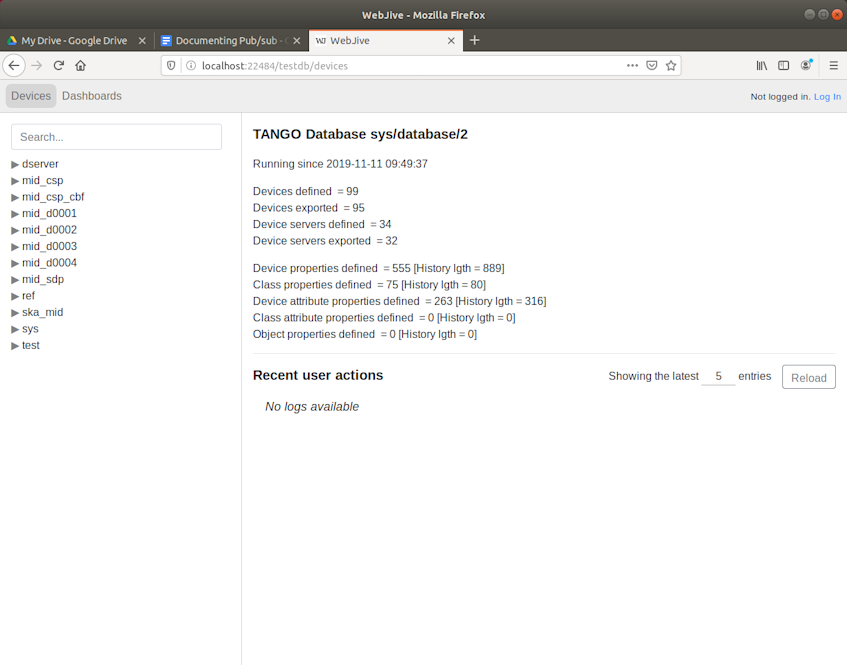

**Figure 1. Screenshot to show Webjive suite 'Devices' screen when user goes to ‘localhost:22484/testdb’ in web browser.**

Tango Jive Set up
-----------------

To run up an instance of Jive in order to set up device polling and events.

* make start jive

After a short pause Jive should launch and present all available Tango devices.  Locate the TangoTest tango device. Navigate through TangoTest-->test-->TangoTest-->sys/tg_test/1. At this level you should be able to see ‘Polling’ and ‘Event’, which when clicked on will allow the user to modify device attribute settings.

.\ |IMG2|\

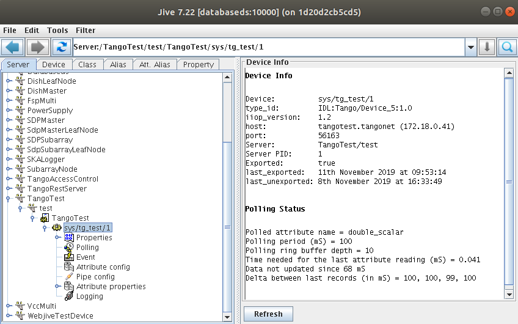

**Figure 2. Screenshot to show location of sys/tg_test/1 using Tango Jive .**

Modifying Polling characteristics
~~~~~~~~~~~~~~~~~~~~~~~~~~~~~~~~~~

In Polling, change polling attribute of double_scalar from default (3000) to 100 (ms). Also ensure that Polled is selected and ticked as shown below.

.\ |IMG3|\

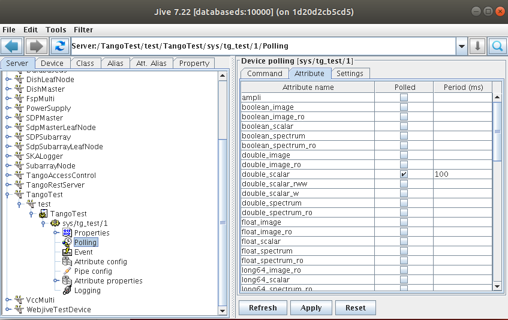

**Figure 3. Screenshot to show the Attribute tab of sys/tg_test/1 Polling characteristics.**

Modifying Event characteristics
~~~~~~~~~~~~~~~~~~~~~~~~~~~~~~~~

In Event, select “Periodic event”, then for attribute “double_scalar” from default (3000) to 100 (ms)

.\ |IMG4|\

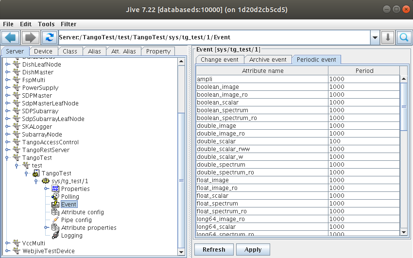

**Figure 4. Screenshot to show the Attribute tab of sys/tg_test/1 Event characteristics.**

Verifying in Webjive Suite
--------------------------
Note.  If Webjive suite is already running, in order to apply these new polling and event settings, it is advised to stop and then restart Webjive suite.

.\ |IMG5|\

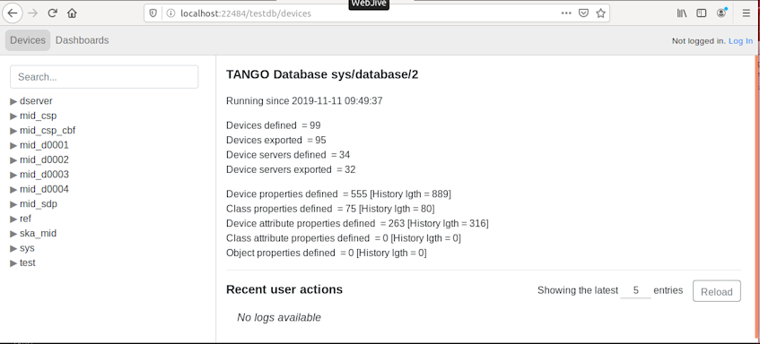

**Figure 5. Screenshot to show the available Tango devcies in Webjive suite.**

Now you should go in to the devices list and ensure that “sys/tg_test/1” is in a running state. This can be confirmed by looking at the top of the right hand side pane of the browser, a green box with “RUNNING” written in it should be visible. If it is not present, the tango test image was not successfully launched, and so this step should be run using the ‘make start tangotest’ command from the terminal.

.\ |IMG6|\

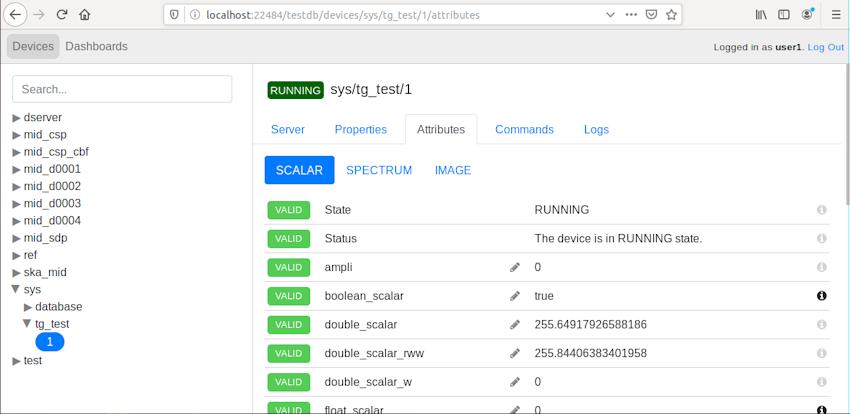

**Figure 6. Screenshot to show the Scalar Attributes of the sys/tg_test/1 Tango device.**

Once the tango test device is confirmed as RUNNING, go to the ‘Dashboard’ of the Webjive suite. From the right hand side widget menu, select the “Attribute Display” widget and drag and drop an instance over onto the left hand side canvas.  Configure the widget as:

- Device: sys/tg_test/1
- Attribute: double_scalar

.\ |IMG7|\

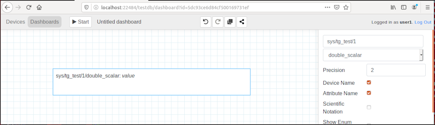

**Figure 7. Screenshot to show the Attribute display widget being set up on the Webjive suite dashboard.**

Once set up, click on the “Start” button to run the dashboard.  After a short pause you should see the displayed attribute value update.

.\ |IMG8|\

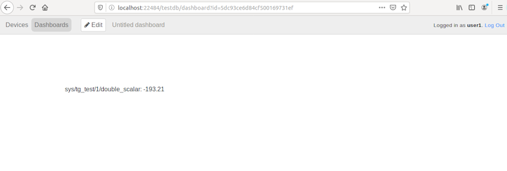

**Figure 8. Screenshot to show Webjive session running and showing the double_scalar value on the attribute display widget.**

Comparison
==========
In order to demonstrate how the pub/sub can be used to allow different device attributes to be presented at different periodicity, the same process should be repeated for the device webjivetestdevice. The Tango device webjivetestdevice was created to allow the pub/sub mechanism to be demonstrated.  It facilitates this by allowing a greater ability to configure polling and event periodicity that what can be achieved with the tg_test device. The tg_test device is limited to only changing its value every second - so even if polling is set to more frequently you won't see any difference, hence webjivetestdevice was written which does not have this restriction.

* Tango Device: test/webjivetestdevice/1
* Attribute: RandomAttr

.\ |IMG9|\

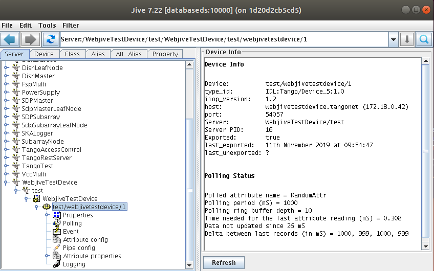

**Figure 9. Screenshot to show Tango Jive and the location of the WebjiveTestDevice in the sever listing.**

Using Jive go to the Polling icon of “WebjiveTestDevice-->test-->WebjiveTestDevice-->test/webjivetestdevice/1”. For attribute RandomAttr, set the polling period to 500(ms) on the Attribute tab.  Ensure that the polled option is ticked.

.\ |IMG10|\

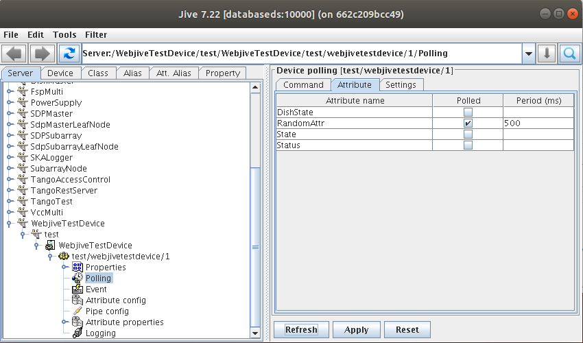

**Figure 10. Screenshot to show Tango Jive and Attribute tab in which the Polling characteristics of the selected attribute needs to be activated and an interval be stated.**

For the same Tango Device, select the Event icon. For the RandomAttr attribute set the period to 1000 (ms) on the Periodic event tab. Furthermore, RandomAttr has the Change Event set in order to send events if the current value differs by 1% from the previous value

.\ |IMG11|\

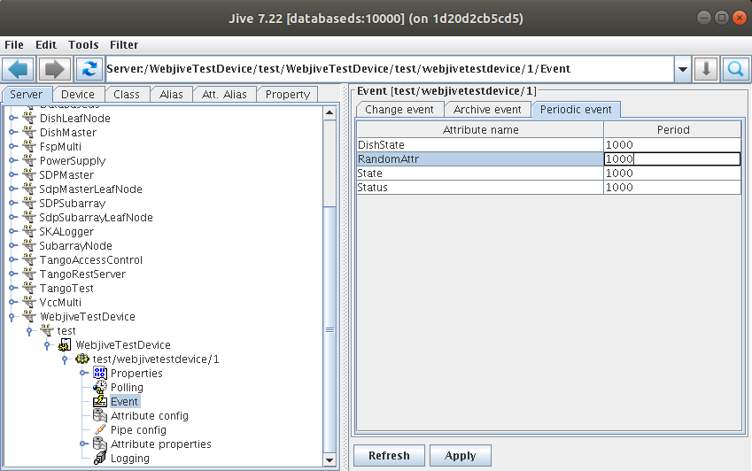

**Figure 11. Screenshot to show Tango Jive and Attribute tab in which the Event characteristics of the selected attribute needs to be activated and an interval be stated.**

Once the tango devices have been set up in Jive, go back to the Webjive suite and drag a new Attribute Display widget onto the canvas. Set up the Attribute display widget to present the RandomAttr device attribute values in Webjive.

.\ |IMG12|\

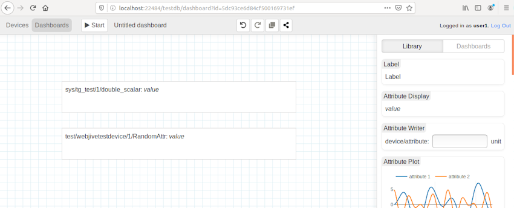

**Figure 12. Screenshot to show Webjive dashboard showing the double_scalar value of tg_test and webjiveTestDevice RandomAttr on seperate attribute display widgets.**

Now run the Webjive suite dashboard by clicking on the Start button.  If set up correctly you should see the two individual device attributes update at different intervals (as defined by the polling and event intervals set via Jive).
