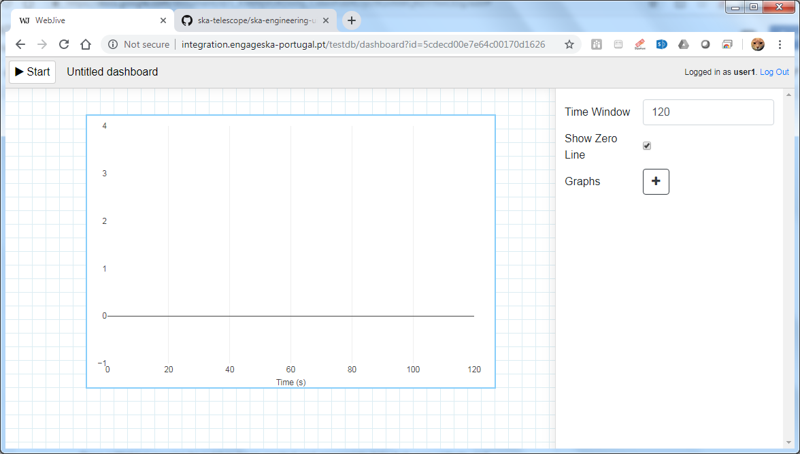
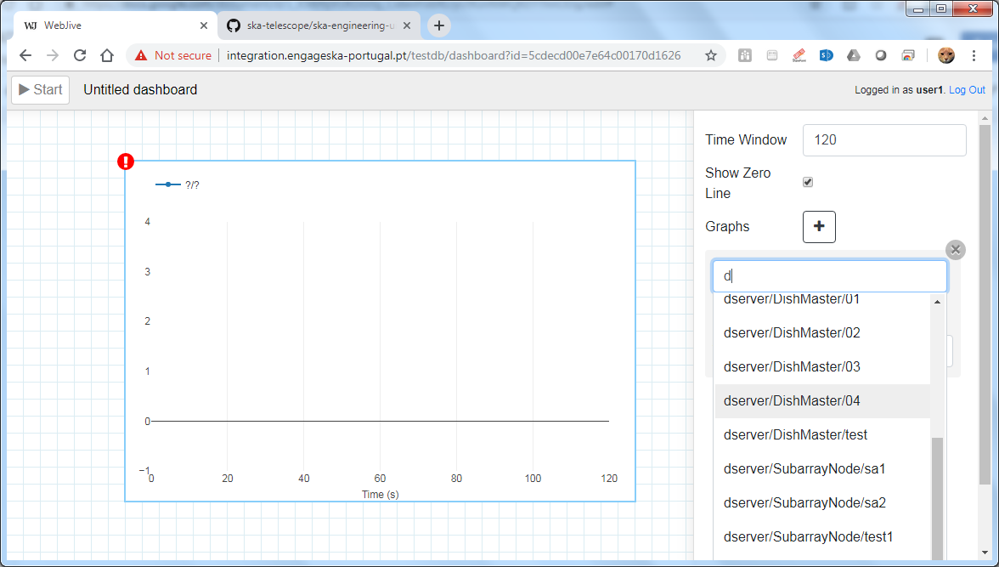
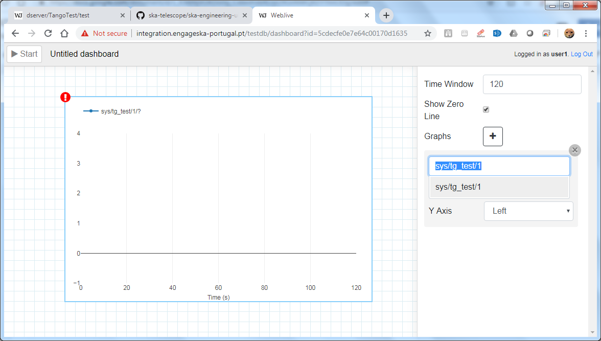
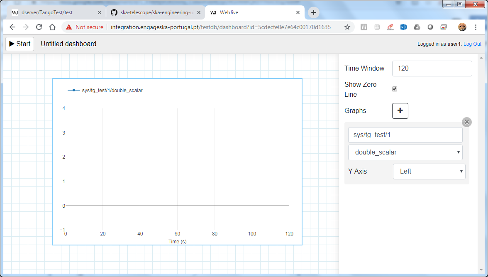
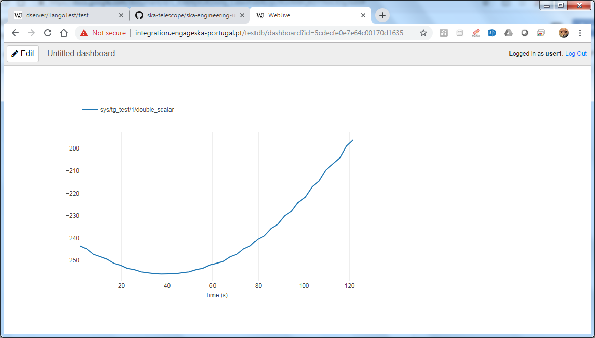

Quick Start
***********

This section aims to provide a high level guide to using Webjive in terms of starting and stopping a session. It also provides an example of how a user can drag and drop a widget onto the canvas, followed by connecting it to a tango device present in the tango device database.  This example is not an extensive how to guide to guide the user through all widget and device connection options, be rather an example which gives an idea about the approach that should be adopted when using Webjive.

Starting the Webjive session
----------------------------

Once the user has placed widgets on the user interface screen and connected them to the appropriate tango device, as described above, the session of Webjive can be started, i.e. data exchange between the device(s) and Webjive can commence.  To do this the ‘Start’ button on the top left of the screen should be pressed.  If started successfully, the ‘Start’ button name should change to ‘Stop’, and after a short delay pertinent data should be presented in the widget(s).

Stopping the Webjive session
----------------------------

To end a running session of Webjive, the user should press the button labelled ‘Edit’ in the top left of the screen, which is the exact same place where the ‘Start’ button was located.

Connecting Tango devices to Webjive widgets
-------------------------------------------

Click on the Webjive dashboard button from the localhost//:22484/testdb/ page to get to the canvas and widget menu, as shown in figure 2.

Drag and drop the required widget on to the canvas. In this example the ‘attribute plot’ is dragged into the canvas, as shown in Figure 6.

.\ |IMG5|\ 

**Figure 6. Screenshot showing the ‘attribute plot’ widget just dragged onto the canvas.**

Once the widget is on the canvas the widget menu is replaced with a configuration table for the attribute plot, as can be seen in Figure 6. In this instance the user has the option to change the time frame of the data that is shown on the plot before the data begins to scroll.  Click on the + labelled ‘Graphs’. Begin to type in the path to the device which is to be connected to be presented with a reducing list of options of available devices (Figure 7). 

.\ |IMG6|\ 

**Figure 7. Screenshot showing the ‘attribute plot’ tango device options once the + button pressed.**

Click on that which you which to be displayed in the attribute plot.  In this example we will select ‘sys/tg_test/1’ and opt to retain the Y-axis on the left hand side of the display (Figure 8).

.\ |IMG7|\ 

**Figure 8. Screenshot showing sys/tg_test/1 being selected from Tango device options.**

Now the user has to select an attribute(s) to be presented on the attribute plot.  In this example we will opt to present just one attribute on the plot, which will be ‘double scalar’ as can be seen in Figure 9. To add further plots to this ‘attribute plot’, click on the + and repeat the process of selecting the device and attribute followed for ‘double scalar’.

.\ |IMG8|\ 

**Figure 9. Screenshot showing the double_scalar attribute of ‘sys/tg_test’ being linked to ‘attribute plot’.**

Click on the ‘Start’ button. The buttons label changes to ‘Edit’, and the connection between the Tango device and the Webjive widget is established.  Data will begin to flow between the device and the widget and be presented on the plot.

.\ |IMG9|\ 

**Figure 10. Screenshot showing the population of ‘attribute plot’ when the Webjive session is running.**

Note that once the Webjive session starts (Figure 10), the user will be unable to edit the widget parameters or canvas layout until the session is stopped using the ‘Edit’ button.

To conclude the Webjive session, the user must press the ‘Edit’ button.  This may seem counterintuitive, but in essence the ‘Edit’ button is the Stop button. Pressing this button does **not** imply that the user must edit the canvas.

For the purposes of this example the Tango device ‘sys/tg_test/1’ belonging to the Webjive Demo Tango Database was used. This is a good test device to use when setting up Webjive initially to establish correct operation.  However when using your own Tango device or linked database, the user should establish the validity of the data being presented on the Webjive widget by some other means to ensure data integrity. One possible means of achieving this is to have an instance of Tango Jive running in parallel to ensure that the data being seen on webjive is the same as that seen on Jive.

Webjive Session Persistence
===========================

A key feature of Webjive is the ability to save a session layout which a User has created, so that it can be reused or edited in the future.  It is important to note that exchanged data is not retained in this file, but rather the session configuration and layout.

Saving the Webjive session 
---------------------------

Once a Webjive session layout has been created and appropriate links between widgets and Tango devices, it can be saved by giving the dashboard a new. A fresh dashboard automatically is named ‘Untitled dashboard’.  The user can simply click and delete this name and replace it with an appropriate dashboard name of choice.

Loading the Webjive session
---------------------------

To open a saved Webjive layout locate and click on the ‘Dashboards’ button (next to the Library button) at the top of the widget drag and drop menu. This will present the user with all available Dashboards. Locate the Dashboard the user wishes to open and click on it. After a short pause the dashboard will have loaded and its widgets displayed on the canvas.

It should be noted that editing the canvas of a dashboard will automatically modify that dashboard and will be saved as such.

Online Demo
===========

It is possible to tryout Webjive before installing a local version.  However this is limited in that the user cannot save or edit canvas or add new Tango devices to the database.  The following link leads to the latest version of the demo available on the SKA repository. http://integration.engageska-portugal.pt/testdb

.. rubric:: Footnotes

.. [#f1]  Guidance created using Readme of the ska-engineering-ui-compose-utils and notes from ticket AT2-139. Link is  `https://github.com/ska-telescope/ska-engineering-ui-compose-utils <https://github.com/ska-telescope/ska-engineering-ui-compose-utils>`__ 
.. [#f2]  Currently SKA Webjive uses the generic username and password credentials

