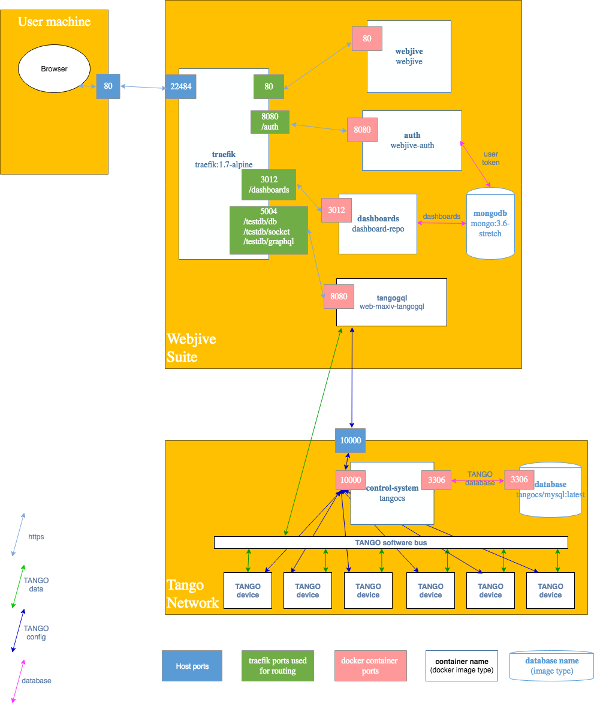

.. raw:: html

   <!----- Conversion time: 1.752 seconds.

   Using this Markdown file:

   1. Cut and paste this output into your source file.
   2. See the notes and action items below regarding this conversion run.
   3. Check the rendered output (headings, lists, code blocks, tables) for proper
      formatting and use a linkchecker before you publish this page.

   Conversion notes:

   * Docs to Markdown version 1.0β17
   * Fri Dec 20 2019 06:20:45 GMT-0800 (PST)
   * Source doc: https://docs.google.com/open?id=1-b0Zx9EgOp0NaHKnjui3Rxa0Pd2mVlg4d-OxPuk1wSQ
   * This document has images: check for >>>>>  gd2md-html alert:  inline image link in generated source and store images to your server.
   ----->

A Component and Connector View of Webjive Suite
===============================================

Introduction
------------

‘Webjive Suite’ is the name given to a collection of software that will
be used to design and build simple engineering web-based user interfaces
for the SKA. These will allow the state of the software and hardware
devices that make up the telescope to be viewed, and let the user send
them commands.

The purpose of this document is to present a ‘component and connector’
view of the WebJive Suite, showing its various parts and how they
interact with each other and the outside world to deliver the required
performance. The intended audience is anyone unfamiliar with the system
who would like a rough but accurate outline of its shape and how it
works. In particular, it may be useful to engineers joining the SKA
software effort.

Webjive Suite Component and Connection Diagram
----------------------------------------------

Webjive Suite Component Table
-----------------------------

.. raw:: html

   <table>

.. raw:: html

   <tr>

.. raw:: html

   <td>

Component

.. raw:: html

   </td>

.. raw:: html

   <td>

Multiplicity

.. raw:: html

   </td>

.. raw:: html

   <td>

Description

.. raw:: html

   </td>

.. raw:: html

   </tr>

.. raw:: html

   <tr>

.. raw:: html

   <td>

traefik

.. raw:: html

   </td>

.. raw:: html

   <td>

1

.. raw:: html

   </td>

.. raw:: html

   <td>

Variously described as an ‘ingress controller’, ‘reverse proxy’ or
‘router’. By parsing the structure of the address, it routes https
traffic from the internet to the appropriate client in the Webjive
Suite.

.. raw:: html

   </td>

.. raw:: html

   </tr>

.. raw:: html

   <tr>

.. raw:: html

   <td>

webjive

.. raw:: html

   </td>

.. raw:: html

   <td>

1

.. raw:: html

   </td>

.. raw:: html

   <td>

A React-based web app supplying pages for creation and editing of
dashboard UIs that display/interact with devices in an attached TANGO
control system.

.. raw:: html

   

Pages are implemented in javascript and typescript.

.. raw:: html

   </td>

.. raw:: html

   </tr>

.. raw:: html

   <tr>

.. raw:: html

   <td>

dashboards

.. raw:: html

   </td>

.. raw:: html

   <td>

0 to many.

.. raw:: html

   </td>

.. raw:: html

   <td>

A ‘dashboard’ is a user interface giving access to devices in the TANGO
control system. A user can create multiple dashboards for different
purposes, and is able to name and share them with other users of the
system.

.. raw:: html

   

‘dashboards’ is the component serving the database repository for
dashboards that have been created.

.. raw:: html

   </td>

.. raw:: html

   </tr>

.. raw:: html

   <tr>

.. raw:: html

   <td>

auth

.. raw:: html

   </td>

.. raw:: html

   <td>

1

.. raw:: html

   </td>

.. raw:: html

   <td>

Authentication server for validating users. Once authenticated a user
token is shared with the other webjive components, allowing them access.
In particular, a token is shared with ‘mongodb’, allowing dashboards
created by the user to be stored there.

.. raw:: html

   </td>

.. raw:: html

   </tr>

.. raw:: html

   <tr>

.. raw:: html

   <td>

mongodb

.. raw:: html

   </td>

.. raw:: html

   <td>

1

.. raw:: html

   </td>

.. raw:: html

   <td>

The database used by the ‘dashboards’ component to store the collection
of dashboards associated with a particular user. Each dashboard is
stored as a JSON document.

.. raw:: html

   </td>

.. raw:: html

   </tr>

.. raw:: html

   <tr>

.. raw:: html

   <td>

tangogql

.. raw:: html

   </td>

.. raw:: html

   <td>

1 to many, each attached to a different TANGO control system.

.. raw:: html

   </td>

.. raw:: html

   <td>

This is a TANGO client connected to a particular TANGO control system,
specified by the TANGO_HOST:port passed to it at startup.

.. raw:: html

   

The component services https GraphQL queries to the attached TANGO
system, finding and returning the values of the requested attributes
etc.

.. raw:: html

   

In principle, multiple ‘tangogql’ servers could be present, addressed
through ‘traefik’ by the TANGO system name - ‘testdb’ in the example
diagram.

.. raw:: html

   </td>

.. raw:: html

   </tr>

.. raw:: html

   <tr>

.. raw:: html

   <td>

TANGO control system

.. raw:: html

   </td>

.. raw:: html

   <td>

1 per TANGO system.

.. raw:: html

   </td>

.. raw:: html

   <td>

This is the public point of contact between the outside world and a
TANGO system.

.. raw:: html

   

This name may be an alias for the term ‘database server’, which is given
in general TANGO docs to a component that seems to perform the same
service.

.. raw:: html

   

The TANGO control system and associated database are used by devices and
clients to connect to the TANGO software bus for that system. Thereafter
communication between TANGO components is direct, over the ‘software
bus’.

.. raw:: html

   </td>

.. raw:: html

   </tr>

.. raw:: html

   <tr>

.. raw:: html

   <td>

TANGO database

.. raw:: html

   </td>

.. raw:: html

   <td>

1 per TANGO system.

.. raw:: html

   </td>

.. raw:: html

   <td>

The database used by the TANGO c.s. to store configuration information
for devices and clients. This is used to set up the network initially
and to connect components.

.. raw:: html

   

tangogql queries the database to gather information about the system.

.. raw:: html

   </td>

.. raw:: html

   </tr>

.. raw:: html

   <tr>

.. raw:: html

   <td>

TANGO software bus

.. raw:: html

   </td>

.. raw:: html

   <td>

1 per TANGO system.

.. raw:: html

   </td>

.. raw:: html

   <td>

The virtual ‘bus’ used for communication between devices and clients
belonging to a TANGO system.

.. raw:: html

   </td>

.. raw:: html

   </tr>

.. raw:: html

   <tr>

.. raw:: html

   <td>

Tango devices

.. raw:: html

   </td>

.. raw:: html

   <td>

1 to many.

.. raw:: html

   </td>

.. raw:: html

   <td>

Tango is the underlying control network for the SKA telescope, The
critical hardware and software components of the telescope will be
represented at some level by tango ‘devices’.

.. raw:: html

   </td>

.. raw:: html

   </tr>

.. raw:: html

   </table>

Webjive Suite Connection Table
------------------------------

.. raw:: html

   <table>

.. raw:: html

   <tr>

.. raw:: html

   <td>

Connection

.. raw:: html

   </td>

.. raw:: html

   <td>

Component 1

.. raw:: html

   </td>

.. raw:: html

   <td>

Component 2

.. raw:: html

   </td>

.. raw:: html

   <td>

Description

.. raw:: html

   </td>

.. raw:: html

   </tr>

.. raw:: html

   <tr>

.. raw:: html

   <td>

https

.. raw:: html

   </td>

.. raw:: html

   <td>

Web browser

.. raw:: html

   

or

.. raw:: html

   

traefik

.. raw:: html

   </td>

.. raw:: html

   <td>

traefik

.. raw:: html

   

webjive

.. raw:: html

   

auth

.. raw:: html

   

dashboards

.. raw:: html

   

tangogql

.. raw:: html

   </td>

.. raw:: html

   <td>

HyperText Transfer Protocol Secure. Communication between browsers and
web app components. Different flavours of message are detected by
‘traefik’ and routed to the appropriate web app.

.. raw:: html

   </td>

.. raw:: html

   </tr>

.. raw:: html

   <tr>

.. raw:: html

   <td>

dashboards

.. raw:: html

   </td>

.. raw:: html

   <td>

dashboards

.. raw:: html

   </td>

.. raw:: html

   <td>

mongodb

.. raw:: html

   </td>

.. raw:: html

   <td>

SQL descriptions of dashboards.

.. raw:: html

   </td>

.. raw:: html

   </tr>

.. raw:: html

   <tr>

.. raw:: html

   <td>

user token

.. raw:: html

   </td>

.. raw:: html

   <td>

auth

.. raw:: html

   </td>

.. raw:: html

   <td>

mongodb

.. raw:: html

   </td>

.. raw:: html

   <td>

User token from ‘auth’ component, authorising them to store data in
mongodb.

.. raw:: html

   </td>

.. raw:: html

   </tr>

.. raw:: html

   <tr>

.. raw:: html

   <td>

TANGO config

.. raw:: html

   </td>

.. raw:: html

   <td>

TANGO control system

.. raw:: html

   </td>

.. raw:: html

   <td>

TANGO device

.. raw:: html

   

or

.. raw:: html

   

TANGO client (tangogql)

.. raw:: html

   </td>

.. raw:: html

   <td>

Configuration messages between TANGO control system, clients and
devices.

.. raw:: html

   </td>

.. raw:: html

   </tr>

.. raw:: html

   <tr>

.. raw:: html

   <td>

TANGO data

.. raw:: html

   </td>

.. raw:: html

   <td>

TANGO device

.. raw:: html

   </td>

.. raw:: html

   <td>

TANGO client (tangogql)

.. raw:: html

   </td>

.. raw:: html

   <td>

Direct communication between components on the TANGO software bus. This
takes the form of setting and querying attributes of the device or
issuing commands.
Devices can also issue Events (for instance when an attribute value
changes). Tango devices can subscribe to the types of events they are
interested in and will receive published events when they occur.

.. raw:: html

   </td>

.. raw:: html

   </tr>

.. raw:: html

   <tr>

.. raw:: html

   <td>

TANGO database

.. raw:: html

   </td>

.. raw:: html

   <td>

TANGO control system

.. raw:: html

   </td>

.. raw:: html

   <td>

database

.. raw:: html

   </td>

.. raw:: html

   <td>

Data on the configuration of a TANGO system.

.. raw:: html

   </td>

.. raw:: html

   </tr>

.. raw:: html

   </table>

Notes
-----

TANGO
~~~~~

Tango is a control system that provides a unified interface to all
equipment, hiding network details and location.

The building block of a Tango network is the device, a software object
that can represent any type of hardware or software. All devices present
a uniform interface of commands, attributes, properties and state.

The ‘identity’ of each Tango system is given by its central database and
associated ‘database server’ (aka in the SKA as ‘TANGO control system’),
which stores configuration data for device startup and acts as a name
server for dynamic network addresses. The machine on which the database
server is running is called the ‘Tango Host’. A client process or device
wanting to join the TANGO system contacts the database server and is put
into direct contact with the target.

Docker
~~~~~~

The components shown above are built as docker images. Each of the
Webjive Suite components shown is represented by a single image within
the Nexus repository and has its own project in GitLab.

At the moment a combination of Make file commands and docker-compose
scripts are used to instantiate the components as docker containers and
to set up the port linkages between them as shown in the figure. It is
likely that docker-compose will be superseded by a kubernetes based
architecture (as is used in the integration environment), but the
component relationships will remain the same.

.. raw:: html

   <!-- Docs to Markdown version 1.0β17 -->
