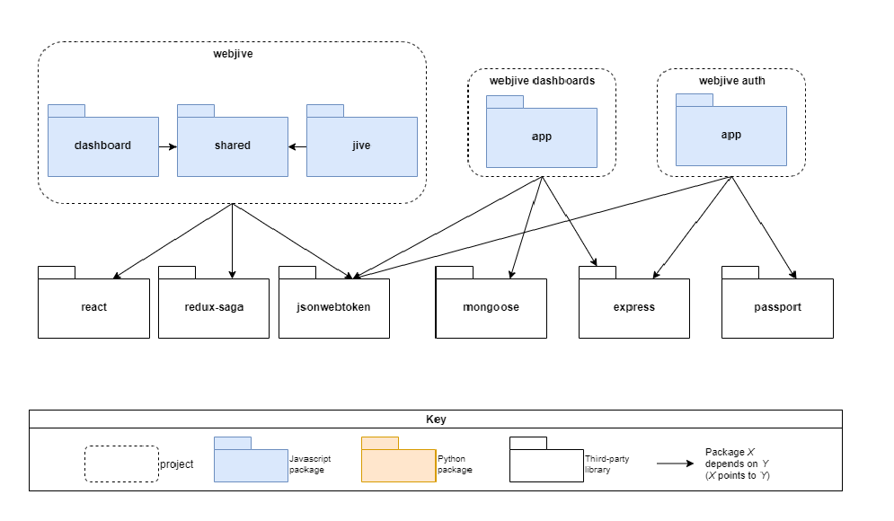
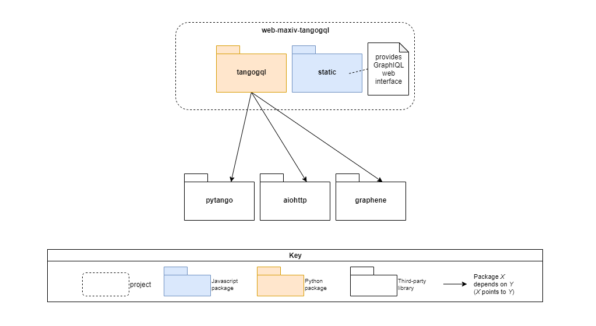

.. raw:: html

   <!----- Conversion time: 1.42 seconds.

   Using this Markdown file:

   1. Cut and paste this output into your source file.
   2. See the notes and action items below regarding this conversion run.
   3. Check the rendered output (headings, lists, code blocks, tables) for proper
      formatting and use a linkchecker before you publish this page.

   Conversion notes:

   * Docs to Markdown version 1.0β17
   * Mon Jan 20 2020 03:22:56 GMT-0800 (PST)
   * Source doc: https://docs.google.com/open?id=125JAovoxmGejH95seepwcrWzt9uTfPDo59Gkw4V7osg
   * This document has images: check for >>>>>  gd2md-html alert:  inline image link in generated source and store images to your server.
   ----->

A Module View Of Webjive Suite
==============================

Introduction
------------

‘Webjive Suite’ is the name given to a collection of software that will
be used to design and build simple engineering web-based user interfaces
for the SKA. These will allow the state of the software and hardware
devices that make up the telescope to be viewed and let the user send
them commands.

The purpose of this document is to show how the key elements of the
Webjive Suite are mapped to modules and subsystems. The **module
architecture view** shows the structure of the modules and submodules
and how system responsibilities are partitioned across them.

In this view, we show dependency relationships and ‘uses’ relationships
between packages. In the below diagram, we can see webjive package is
dependent on react, redux-saga and jsonwebtoken libraries. Similarly,
other components (webjive dashboard,webjive auth and web-maxiv-tangogql)
and their dependency relationships on other packages have been shown in
the diagrams respectively.

Webjive Suite - Front End Module View Diagram
---------------------------------------------

Webjive Suite - TangoGQL Module View Diagram
--------------------------------------------

Webjive Suite Package Table
---------------------------

.. raw:: html

   <table>

.. raw:: html

   <tr>

.. raw:: html

   <td>

Name

.. raw:: html

   </td>

.. raw:: html

   <td>

Description

.. raw:: html

   </td>

.. raw:: html

   </tr>

.. raw:: html

   <tr>

.. raw:: html

   <td>

webjive

.. raw:: html

   </td>

.. raw:: html

   <td>

Webjive is a React client that permits to explore Tango devices and to
create custom dashboards, using a collection of widgets.

.. raw:: html

   </td>

.. raw:: html

   </tr>

.. raw:: html

   <tr>

.. raw:: html

   <td>

webjive auth

.. raw:: html

   </td>

.. raw:: html

   <td>

Webjive uses webjive-auth to manage users. webjive-auth access mongo DB
to retrieve user information.

.. raw:: html

   </td>

.. raw:: html

   </tr>

.. raw:: html

   <tr>

.. raw:: html

   <td>

webjive dashboards

.. raw:: html

   </td>

.. raw:: html

   <td>

A ‘dashboard’ is a user interface giving access to devices in the TANGO
control system. A user can create multiple dashboards for different
purposes and is able to name and share them with other users of the
system.
The dashboards created by the user into the system, are stored in a
MongoDB database through webjive dashboard application.

.. raw:: html

   </td>

.. raw:: html

   </tr>

.. raw:: html

   <tr>

.. raw:: html

   <td>

shared

.. raw:: html

   </td>

.. raw:: html

   <td>

Shared contains the components of the webjive application that are used
by both dashboard and jive.

.. raw:: html

   </td>

.. raw:: html

   </tr>

.. raw:: html

   <tr>

.. raw:: html

   <td>

react framework

.. raw:: html

   </td>

.. raw:: html

   <td>

A React-based web app supplying pages for creation and editing of
dashboard UIs that display/interact with devices in an attached TANGO
control system.

.. raw:: html

   </td>

.. raw:: html

   </tr>

.. raw:: html

   <tr>

.. raw:: html

   <td>

jsonwebtoken

.. raw:: html

   </td>

.. raw:: html

   <td>

This is a library that implements the ‘JSON Web Token’ standard for
signing and securely transmitting information between parties as a JSON
object. It is used for reading and updating the user token passed
between the different applications of the webjive suite.

.. raw:: html

   </td>

.. raw:: html

   </tr>

.. raw:: html

   <tr>

.. raw:: html

   <td>

redux

.. raw:: html

   </td>

.. raw:: html

   <td>

Redux provides a shared state model used by the components of the
webjive application.

.. raw:: html

   </td>

.. raw:: html

   </tr>

.. raw:: html

   <tr>

.. raw:: html

   <td>

redux-saga

.. raw:: html

   </td>

.. raw:: html

   <td>

Redux-sagas provide an asynchronous mechanism for updating shared state
provided by redux.

.. raw:: html

   </td>

.. raw:: html

   </tr>

.. raw:: html

   <tr>

.. raw:: html

   <td>

mongoose

.. raw:: html

   </td>

.. raw:: html

   <td>

Library used for communicating with the MongoDB to query the database
and to store and retrieve the dashboards for a given user.

.. raw:: html

   </td>

.. raw:: html

   </tr>

.. raw:: html

   <tr>

.. raw:: html

   <td>

passport

.. raw:: html

   </td>

.. raw:: html

   <td>

A third party authentication framework used to allow the webjive auth
component to be easily hooked into a range of existing authentication
models and tools. At the moment it is only really used for MaxIVs
authentication via their LDAP server.

.. raw:: html

   </td>

.. raw:: html

   </tr>

.. raw:: html

   <tr>

.. raw:: html

   <td>

express

.. raw:: html

   </td>

.. raw:: html

   <td>

Express is the lightweight javascript based framework.We use to serve
webjive dashboards and webjive-auth web services.

.. raw:: html

   </td>

.. raw:: html

   </tr>

.. raw:: html

   <tr>

.. raw:: html

   <td>

tangogql

.. raw:: html

   </td>

.. raw:: html

   <td>

This is a TANGO client connected to a particular TANGO control system.
The component services https GraphQL queries to the attached TANGO
system, finding and returning the values of the requested attributes
etc.

.. raw:: html

   </td>

.. raw:: html

   </tr>

.. raw:: html

   <tr>

.. raw:: html

   <td>

static

.. raw:: html

   </td>

.. raw:: html

   <td>

Static is the javascript, HTML and CSS that provides the GraphQL
interface provided by TangoGQL.

.. raw:: html

   </td>

.. raw:: html

   </tr>

.. raw:: html

   <tr>

.. raw:: html

   <td>

aiohttp

.. raw:: html

   </td>

.. raw:: html

   <td>

HTTP server for Python, used to run the server and provide endpoints.

.. raw:: html

   </td>

.. raw:: html

   </tr>

.. raw:: html

   <tr>

.. raw:: html

   <td>

graphene

.. raw:: html

   </td>

.. raw:: html

   <td>

A GraphQL implementation in python used to create GraphQL servers.

.. raw:: html

   

Graphene maps the GraphQL schema to a number of ‘endpoints’. Each
endpoint contains the Python code to fulfil a particular type of GraphQL
request. The data structures returned map to the structures within the
schema.
It gives direct access to write GraphQL queries through the TangoGQL
application.

.. raw:: html

   </td>

.. raw:: html

   </tr>

.. raw:: html

   <tr>

.. raw:: html

   <td>

pytango

.. raw:: html

   </td>

.. raw:: html

   <td>

It is used for querying the Tango database at TANGO_HOST.

.. raw:: html

   </td>

.. raw:: html

   </tr>

.. raw:: html

   </table>

.. raw:: html

   <!-- Docs to Markdown version 1.0β17 -->
